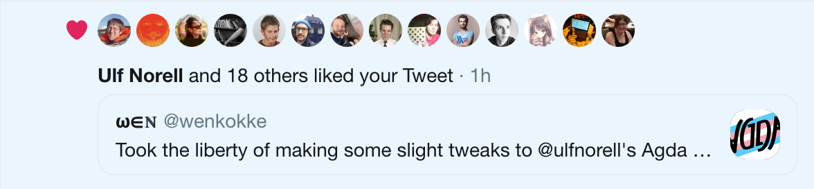
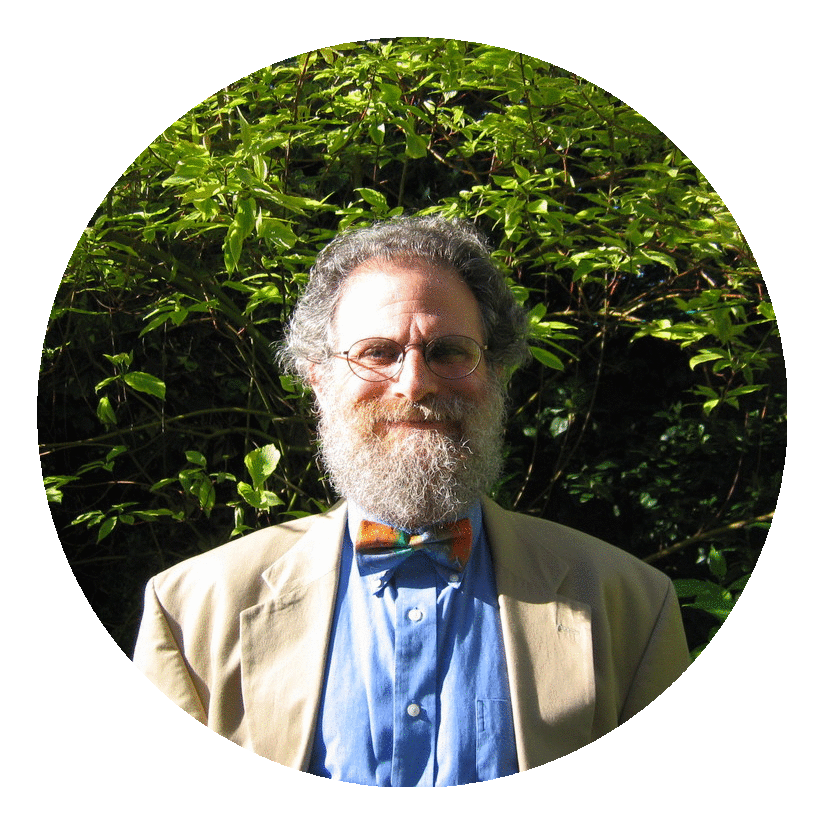
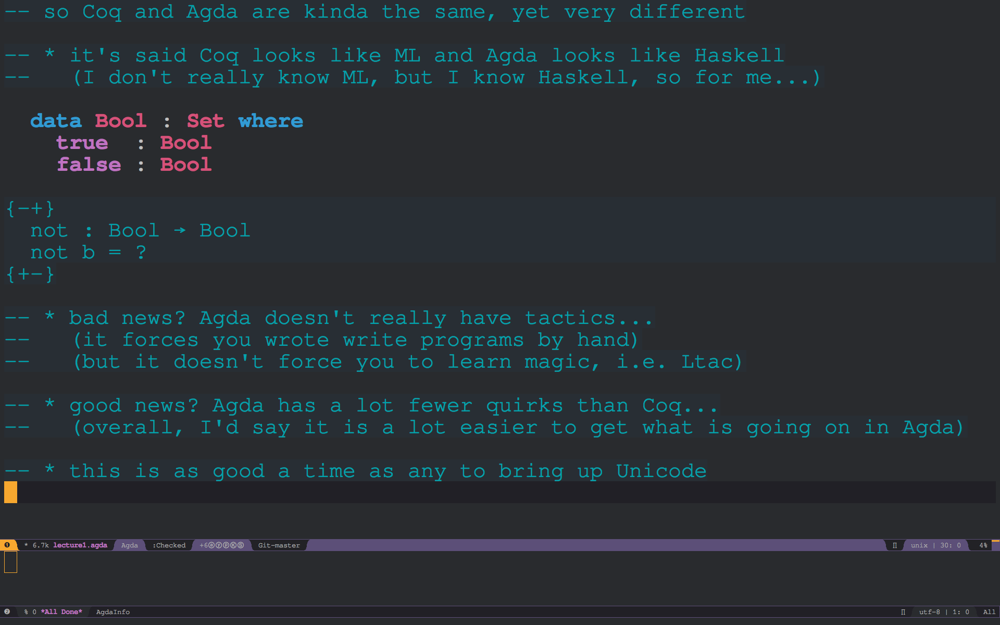
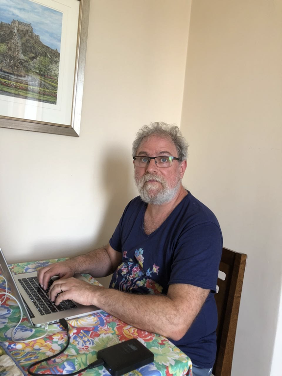

# Programming Programming <br /> Language Foundations <br /> in Agda in Agda

## by Wen Kokke

---

You: "What's an 'Agda'?"

Me: "It's a proof assistant!"

You: "What's a proof assistant?"

Me: "Uh..."

^
So, uh, before we dive in, I should perhaps set the stage.

^
A proof assistant is a bunch of software to help you with writing formal, machine-checked proofs.

^
And sure, Agda is that, but Agda is also a dependently-typed programming language. 

^
Turns out if you go deep enough, the Curry-Howard correspondence between proofs and programs kinda... breaks down the distinction.

^
There will be two main players in this story.

---

[.header: text-scale(0.53225)]

## ACL2, Agda, **Agda 2**, Albatross, ALF, Aquarius, ATS, Automath, <br /> a blackboard, Blodwen, Cambridge LCF, Cayenne, **Cedille**, Clam, Clam 2, Clam 3, CLIN, **Coq**, Dafny, Dependent ML, DISCOUNT, Epigram, EQP, ETPS, F\*, **Haskell**, HOL Light, **HOL4**, HOL88, HOL90, **Idris**, IMPS, InKa, Intercal, Isabelle, Jape, KeY, LambdaClam, LCF77, **Lean**, LEGO, Logic Theorist, Mace, **Mace4**, Matita, Metamath, me, MINLOG, Mizar, MKRP, NQTHM, NuPRL, OLEG, OMEGA, OSHL, **Otter**, Peers, Peers-mcd.a, Peers-mcd.b, Peers-mcd.c, Peers-mcd.d, PhoX, PLTP, PRESS, ProCom, **Prover9**, PRV, PVS, RDL, scunac, SETHEO, SNARK, TPS, Twelf, Typelab, Yarrow


^
THESE are proof assistants.

^
I've highlighted those that I've worked with personally.

^
If you don't think Haskell is a proof assistant, tell that to the proof of cut elimination for Lambek-calculus that I wrote in Haskell.

^
Anyway, these run the gamut from "checks if a theorem is provable in first-order logic" to "checks if your imperative program is doing something stupid" to "maybe we can do all of math here?"

^
There's a specific kind of proof assistant that I care about: dependently-typed programming languages. They live in the last category, usually.

---

# [fit] Coq
### by Bruno Barras, Yves Bertot, Pierre Castéran, **Thierry Coquand**, Jean-Christophe Filliâtre, Hugo Herbelin, **Gérard Pierre Huet**, Chetan Murthy, and **Christine Paulin-Mohring** <br /> (and at least 133 other contributors)


---

# [fit] Agda
### by **Andreas Abel**, Stevan Andjelkovic, Marcin Benke, James Chapman, Jesper Cockx, Jean-Philippe Bernardy, **Nils Anders Danielsson**, Dominique Devriese, Péter Diviánszky, Olle Fredriksson, Samuel Gélineau, Daniel Gustafsson, Patrik Jansson, Alan Jeffrey, Fredrik Lindblad, Stefan Monnier, Darin Morrison, Guilhem Moulin, Fredrik Nordvall Forsberg, **Ulf Norell**, Nicolas Pouillard, Andrés Sicard-Ramírez, Wouter Swierstra, Makoto Takeyama, Andrea Vezzosi, and Nobuo Yamashita <br /> (and at least 74 other contributors)

 


^
Agda doesn't conventionally have a logo, but I think I've solved that problem... 

^
Btw, this is a slightly tweaked version of Ulf's logo design.

---

[.background-color: #000000]



^
And I'm pretty sure this means it's the official logo now.

---

# [fit] Agda
### by **Andreas Abel**, Stevan Andjelkovic, Marcin Benke, James Chapman, Jesper Cockx, Jean-Philippe Bernardy, **Nils Anders Danielsson**, Dominique Devriese, Péter Diviánszky, Olle Fredriksson, Samuel Gélineau, Daniel Gustafsson, Patrik Jansson, Alan Jeffrey, Fredrik Lindblad, Stefan Monnier, Darin Morrison, Guilhem Moulin, Fredrik Nordvall Forsberg, **Ulf Norell**, Nicolas Pouillard, Andrés Sicard-Ramírez, Wouter Swierstra, Makoto Takeyama, Andrea Vezzosi, and Nobuo Yamashita <br /> (and at least 74 other contributors)


^
No matter how much certain supervisors of mine would like it to be different.

^
Btw, this future T-shirt was brought to you by Aive Kalmus. 

^
I have changed the colour scheme a wee bit.

---

# A Brief History of Wen
## (the relevant bits)

---

# (2014) <br /> I was taught Coq and Agda in the same course, <br /> one after the other, <br /> by this guy.


^
Was able to work with both languages.

^
Formalised Jeremy Gibbons' Enumerating the Rationals in Coq.

^
Didn't understand what Gallina code was generated when running Ltac.

^
Wasn't until I learned Agda that Coq started to make sense.

---



# (2016) <br /> Taught Software foundations, <br /> with this guy. <br /><br /> He did most of the lecturing, tbh.

^
In my first year, I taught from Software Foundations with Phil.

^
He did most of the lecturing, tbh, in part because lecturing students was FAR above my pay grade.

^
The plan for PLFA was hatched.

^
We hoped to teach the students Agda in the following year.

^
So we wrote some initial chapters.

---


# (2017) <br /> Taught Software foundations, <br /> with this guy. <br /><br /> I gave several additional lectures on Agda!

^
We failed, of course. 

^
I was ready to give it a shot, but Phil had all these concerns about "keeping up the quality of the course" and "not going into a course with more than half of the lecture notes unwritten."

^
I DID teach the students some Agda, mostly based on Conor's lecture notes of the previous year. The students had already finished Software Foundations at this point, which was interesting.

^
Plus, I got to finally use comedy.el!

---

[.background-color: #000000]



^
Isn't it beautiful! 😭

^
That's what REAL slides look like.

---


# (2018) <br /> Taught Programming Language Foundations <br /> in Agda!

---


# [fit] PLFA

### by Marko Dimjašević, **Wen Kokke**, Jeremy Siek, Zbigniew Stanasiuk, **Philip Wadler**, and Yasu Watanabe <br /> (and 32 other contributors)

---

# How most of PLFA was produced:



---


---

```coq
Theorem progress : ∀ t T, ⊢ t ∈ T → value t ∨ ∃t', t --> t'.
  
Proof with eauto.
  intros t T Ht.
  remember (@empty ty) as Gamma.
  induction Ht; subst Gamma...
  - inversion H.
  - right. destruct IHHt1...
    + destruct IHHt2...
      * assert (∃x0 t0, t1 = abs x0 T11 t0).
        eapply canonical_forms_fun; eauto.
        destruct H1 as [x0 [t0 Heq]]. subst.
        ∃([x0:=t2]t0)...
      * inversion H0 as [t2' Hstp]. ∃(app t1 t2')...
    + inversion H as [t1' Hstp]. ∃(app t1' t2)...
  - right. destruct IHHt1...
    + destruct (canonical_forms_bool t1); subst; eauto.
    + inversion H as [t1' Hstp]. ∃(test t1' t2 t3)...
Qed.
```

---

# My Troubles with Coq...

---

# ...disappear with Agda!

--- 

<!--!>

coq vs. agda in teaching:

* gallina & ltac vs. agda
* tactics obscure understanding
* notation is... less readable (+unicode rant)

progress + preservation = evaluation:

* progress proof is an *evaluation strategy*

spoilers:

* system f
* abstract machines
* linear type systems using quantitative type theory
* session typed systems using quantitative type theory
* denotational semantics of the untyped lambda calculus
* please let us know if you'd like to contribute!

<---->

---


---
