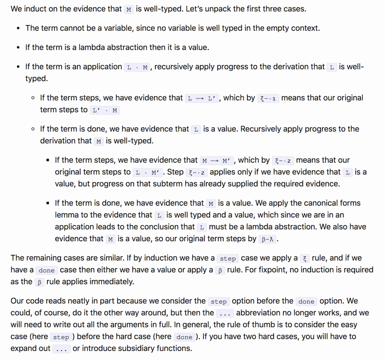
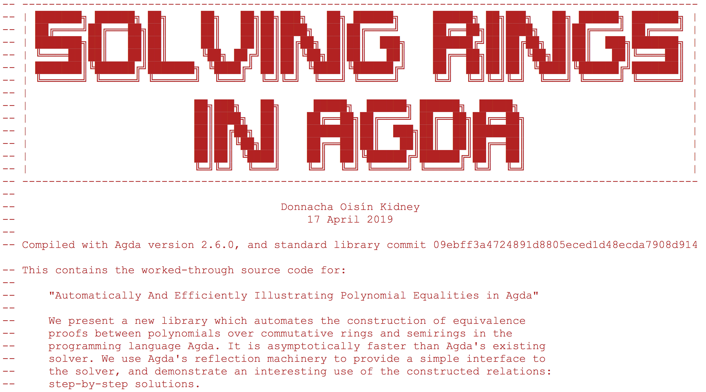

# Programming Programming   Language Foundations   in Agda in Agda

## by Wen Kokke

^
Hi!

^
We're gonna talk about PLFA:
a textbook for teaching Programming Languages
using the Agda proof assistant.

---

<!-- SECTION 1: WHAT IS A PROOF ASSISTANT -->

You: "What's an 'Agda'?"

Me: "It's a proof assistant!"

You: "What's a proof assistant?"

Me: "Uh..."

^
So, uh, before we dive in, I should perhaps set the stage.

---

[.header: text-scale(0.51)]

## ACL2, Agda, **Agda 2**, Albatross, ALF, Aquarius, ATS, Automath,   a blackboard, Blodwen, Cambridge LCF, Cayenne, **Cedille**, Clam, Clam 2, Clam 3, CLIN, **Coq**, Dafny, Dependent ML, DISCOUNT, Epigram, EQP, ETPS, F\*, **Haskell**, HOL Light, **HOL4**, HOL88, HOL90, **Idris**, IMPS, InKa, Intercal, Isabelle, Jape, KeY, LambdaClam, LCF77, **Lean**, LEGO, Logic Theorist, Mace, **Mace4**, Matita, Metamath, me, MINLOG, Mizar, MKRP, NQTHM, NuPRL, OLEG, OMEGA, OSHL, **Otter**, Peers, Peers-mcd.a, Peers-mcd.b, Peers-mcd.c, Peers-mcd.d, PhoX, PLTP, PRESS, ProCom, **Prover9**, PRV, PVS, RDL, scunac, SETHEO, SNARK, SASyLF, TPS, Twelf, Tutch, Typelab, Yarrow

^
THESE are proof assistants.

^
A proof assistant is a bunch of software to help you with writing formal, machine-checked proofs.

^
I've highlighted those that I've worked with personally.

^
If you don't think Haskell is a proof assistant, tell that to the proof of cut elimination for Lambek-calculus that I wrote in Haskell.

^
Anyway, these run the gamut from "checks if a theorem is provable in first-order logic" to "checks if your imperative program is doing something stupid" to "maybe we can do all of math here?"

^
There's a specific kind of proof assistant that I care about: dependently-typed programming languages. They live in the last category, usually.

^
Turns out if you go deep enough, the Curry-Howard correspondence between proofs and programs kinda... 
breaks down the distinction.

^
There will be two main players in this story.

---

# [fit] Coq
### by Bruno Barras, Yves Bertot, Pierre Castéran, **Thierry Coquand**, Jean-Christophe Filliâtre, Hugo Herbelin, **Gérard Pierre Huet**, Chetan Murthy, and **Christine Paulin-Mohring**   (and at least 133 other contributors)

^
First, Coq.

^
Coq is a proof assistant based on the Calculus of Inductive Constructions.

^
It was built by Thierry Coquand, Gérard Huet, Christine Paulin-Mohring, and _many others._

^
These are the people ACM decide to thank, but Coq has grown so vast that of the top 20 contributors only _two_ are in this list.

^
Coq is firmly rooted in the ML tradition, is probably the most-used proof assistant, and has strong support for proof automation.

---

# [fit] Agda
### by **Andreas Abel**, Stevan Andjelkovic, Marcin Benke, James Chapman, Jesper Cockx, Jean-Philippe Bernardy, **Nils Anders Danielsson**, Dominique Devriese, Péter Diviánszky, Olle Fredriksson, Samuel Gélineau, Daniel Gustafsson, Patrik Jansson, Alan Jeffrey, Fredrik Lindblad, Stefan Monnier, Darin Morrison, Guilhem Moulin, Fredrik Nordvall Forsberg, **Ulf Norell**, Nicolas Pouillard, Andrés Sicard-Ramírez, Wouter Swierstra, Makoto Takeyama, Andrea Vezzosi, and Nobuo Yamashita   (and at least 74 other contributors)

^
Second, of course, Agda.

^
Agda is a proof assistant based on Martin Löf type theory.

^
They maintain an authors file, which I've reproduced here, but git log thinks I might've missed out on 74 contributors.

^
If Coq is rooted in the ML tradition, Agda is rooted in the Haskell tradition. It's less well used, in part – I think – because it offers fairly little in terms of proof automation.

^
Agda doesn't conventionally have a logo, but I think I've solved that problem...

^
Btw, this is a slightly tweaked version of Ulf's logo design.

---

[.background-color: #000000]

^
And I'm pretty sure this means it's the official logo now.

^
No matter how much certain supervisors of mine would like it to be different.

---

# [fit] Agda
### by **Andreas Abel**, Stevan Andjelkovic, Marcin Benke, James Chapman, Jesper Cockx, Jean-Philippe Bernardy, **Nils Anders Danielsson**, Dominique Devriese, Péter Diviánszky, Olle Fredriksson, Samuel Gélineau, Daniel Gustafsson, Patrik Jansson, Alan Jeffrey, Fredrik Lindblad, Stefan Monnier, Darin Morrison, Guilhem Moulin, Fredrik Nordvall Forsberg, **Ulf Norell**, Nicolas Pouillard, Andrés Sicard-Ramírez, Wouter Swierstra, Makoto Takeyama, Andrea Vezzosi, and Nobuo Yamashita   (and at least 74 other contributors)

^
Btw, this future T-shirt was brought to you in part by Aive Kalmus.

^
I have changed the colour scheme a wee bit.

---

<!-- SECTION 2: WHY TEACH PROGRAMMING LANGUAGES WITH A PROOF ASSISTANT? -->

You: "Why use proof assistant in my class?"

^
Maybe your class already has a proof assistant?

^
Maybe her name is Wen, and you pay her at standard TA rates?

^
Honestly, I'm putting myself out of work here, aren't I?

Me: "This... is all I've ever known???"

^
But, *full disclosure*, teaching programming language foundations using a proof assistant is all I've every known.

---

^
I'm a baby, basically.

---

[.background-color: #000000]

^
You see, when Benjamin was running this slide, at ICFP 2009, I had just started my second year of undergrad.

^
Which means that he started building it _before_ I even started undergrad.

^
I feel that Software Foundations is well-established at this point.

^
However, it's probably useful to go over his main argument.

---

[.background-color: #000000]

^
He starts out by stressing the need for PL teaching to innovate.

^
Innovate or die. It's very dramatic.

^
Then sketches his list of what he thinks should be in a PL course.

^
This corresponds fairly straightforward to the ToC for SF. No accident there.

---

[.background-color: #000000]

^
Then he pauses! He forgot proofs!

^
You see, all these topics require a certain level of mathematical maturity.

^
In a course for arbitrary computer science students, it's really bad to assume this.

^
His words, not mine, but I agree.

^
He then stresses that *teaching* how to read and write mathematical proofs requires a lot of back-and-forth.

^
Essentially, you'd need once teaching assistant per student!

---

[.background-color: #000000]

^
But aha! That teaching assistant can be *automated*!

^
All they basically do is point out why your proofs are bad.

^
So if we *center* our course around teaching *using* a proof assistant, we can *get* one TA per student!

---

You: "This... is all you've ever known?"

Me: "Y-y-yes?"

^
So really, learning programming language theory with a proof assistant is all I ever knew.

^
It is how I _properly_ came to grips with induction.

^
It is how I learned _a lot_ of my basic maths knowledge.

---

# (2014)   I was taught from Software Foundations, and learned Coq and Agda in the same course,   one after the other,   taught by this guy.

^
You see, I was taught from Software Foundations, learning programming language foundations and picking up Coq along the way.

^
Learned Agda in the *same* course.

^
Was able to work with both languages.

^
Verified a functional pearl in Coq.

^
Didn't understand Ltac or what Gallina code it was generating.

^
Wasn't until I learned Agda that Coq started to make sense.

---

# (2014–2016)   Formalised several calculi using Agda,   mostly substructural,   with this guy.

^
Then, for a long time, I worked with Michael Moortgat, who crops his portraits extremely closely, formalising a bunch of calculi using Agda.

^
Most of them substructural:
linear lambda calculus,
Lambek calculus, _etc._

---

# (2016)   Taught Software foundations,   with this guy.    He did most of the lecturing, tbh.

^
In 2016, I taught from Software Foundations with Phil.

^
He did most of the lecturing, tbh, in part because lecturing students was FAR above my pay grade.

^
The plan for PLFA was hatched.

^
We hoped to teach the students Agda in the following year.

^
So we wrote some initial chapters.

---

# (2017)   Taught Software foundations,   with this guy.    I gave several additional lectures on Agda!

^
We failed, of course.

^
I was ready to give it a shot, but Phil had all these concerns about "keeping up the quality of the course" and "not going into a course with more than half of the lecture notes unwritten."

^
I DID teach the students some Agda, mostly based on Conor's lecture notes of the previous year. The students had already finished Software Foundations at this point, which was interesting.

^
Plus, I got to finally use comedy.el!

---

[.background-color: #000000]

^
Isn't it beautiful! 😭

^
That's what REAL slides look like.

---

# (2018)   Taught Programming Language Foundations   in Agda!

^
But the next year, we taught Programming Language Foundations in Agda!

---

<!-- SECTION 3: WHY USE AGDA? -->

You: "Hold on. Why Agda? Isn't Software Foundations, just like, *fine*???"

Me: "Uh... good question!"

---

# My Troubles with Coq...

- everything is done _twice_,
  once in Gallina, once in Ltac:

  `pair` and `match` vs. `split` and `destruct`

- everything is done _four times_,
  'cuz names and notation are different things:

  `(prod A B)` is written `(A * B)`
  `(pair A B)` is written `(A , B)`

^
Coq consists of two separate languages, Gallina and Ltac.

^
This causes some duplication:

^
For the pair type, students need to learn `prod` and `pair`, `split` and `destruct`.

---

# My Troubles with Coq...

- it's not even just _four times_! 😫

  `split`
  vs. `apply pair`
  vs. `constructor 1`
  vs. `constructor`
  vs. `auto`

- this landscape of spurious equivalences burdens and confuses the students!

^
It's not even just *that*:
Ltac is a poorly designed language too.
There is a lot of duplication.

^
Sure, SF teaches this things in a highly restricted manner, but your students *will* Google, and they *will* find the complete tactics index, and they *will* get confused.

<!--!>
I once read a quote from Matz:
No matter if you write `length`, `size`, or `count`, it should work.
I thought that was really profound.
I never really *read* code back then.
<---->

---

# ...disappear with Agda!

- Agda doesn't have tactics

- everything is done _once_

  `_×_` and `_,_`

- no distinction between name and notation,
  the name for the product type is `_×_`

---

# My Troubles with Coq...

- Ltac code is *imperative*
  you're manipulating an invisible proof stack

- to understand Ltac you *have to* step through

- Ltac is not readable

^
Isn't it embarrassing that in what is the *peak* of dependently-typed functional programming we use, *almost exclusively*, an imperative language?

---

# ...disappear with Agda!

- Agda doesn't have tactics

# [fit] 🤷🏻‍♀

- wait, is that fair?

^
You might ask "Wait, is that fair?"

^
We're _losing_ proof automation!

^
In Software Foundations, you write _all_ proofs using tactics, even the simple ones.

^
Often, each tactic corresponds to _one_ programming construct.

^
Basically, you write the proof object in as much detail, but using the indirection of tactics.

^
Yes, we don't have `crush` in Agda, but `crush` doesn't offer understanding.

^
Tactics are good to automate things you _already understand_.

---

# My Troubles with Coq...

> "For me, if [induction] was the only thing they got out of this course, that would be okay."
> — Benjamin Pierce

- *induction* can be confusing
- *induction* does the same as *destruct*, but gives you this random other data... sometimes?
- *induction* interacts with *intros*

^
In his talk, Benjamin says that for him, if all a student learns in his course is induction, that's fine!

^
But induction in Coq can be extremely confusing.

^
It does the same as *destruct* and *case*, but sometimes gives you this random other stuff?

^
And it interacts with *intros* in weird ways, giving you *different* stuff depending on which variables you've already introduced.

^
Sure, all this stuff makes sense to you, but *you already understand induction!*

---

# ...disappear with Agda!

- in Agda, *induction* is *recursion*

^
In Agda, induction is just recursion.

^
And sure, recursion is a concept students struggle with as well.

^
But they're more likely to have heard of this already, and to have some experience with it.

^
It gives them a basis for understanding induction.

---

You: "Okay. I'm convinced. Let's talk PLFA."

---

<!-- SECTION 4: LET'S TALK ABOUT PLFA! -->

# [fit] PLFA

### by Marko Dimjašević, **Wen Kokke**, Jeremy Siek, Zbigniew Stanasiuk, **Philip Wadler**, and Yasu Watanabe   (and 32 other contributors)

^
So let's talk about PLFA.

^
PLFA was initially a project by me and Phil.

^
You may notice some other names there. I've included our current top four contributors in the list as well. 

^
Marco, Zbigniew, Yasu, and others have been hard at work finding all the mistakes we made.

^
Jeremy is working hard adding a whole new section for mistakes to hide in!

---

# How most of PLFA was produced:

^
This is how most of PLFA was produced.

^
Phil was fortunate enough to be able to take a sabbatical.
Most of the writing in the current version was done by him.

^
Unrelated, this is straight-up my favourite slide.

---

# Our Concerns with Agda...

- is Agda stable enough?
- does the lack of automation blow up proof size?

^
Our main concern with Agda:
can this even be done?

^
Would the lack of proof automation blow up the proofs, rendering them unteachable?

^
As it turns out, no.

^
Anyway, let's compare two proofs between PLFA and SF. Early on, we fixated on 'progress', so why not that?

---

^
First off, we set the stage.

^
We explain that progress means that for each term, it is either a value, or you take a step, but that this only holds for well-typed values without any free variables.

^
We define a data type for progress, with two cases: done for values, step for steps. We do this because it makes the proof much more readable.

---

^
Remember, this is for PCF.

^
We induct on the evidence that the term is well-typed.

^
The term cannot be a variable, since no variable is well typed in the empty context. Note: we use back ticks to mark variables, and the `()` are Agda's way of saying "this value cannot exist".

^
If the term is a lambda abstraction then it is a value.

^
If the term is an application L · M, recursively apply progress to the derivation that L is well-typed:
- If the term steps, we have evidence that L —→ L′, which by ξ-·₁ means that our original term steps to L′ · M
- If the term is done, we have evidence that L is a value. Recursively apply progress to the derivation that M is well-typed:
+ If the term steps, we have evidence that M —→ M′, which by ξ-·₂ means that our original term steps to L · M′. Step ξ-·₂ applies only if we have evidence that L is a value, but progress on that subterm has already supplied the required evidence.
+ If the term is done, we have evidence that M is a value. We apply the canonical forms lemma to the evidence that L is well typed and a value, which since we are in an application leads to the conclusion that L must be a lambda abstraction. We also have evidence that M is a value, so our original term steps by β-ƛ.
- The remaining cases are similar. If by induction we have a step case we apply a ξ rule, and if we have a done case then either we have a value or apply a β rule. For fixpoint, no induction is required as the β rule applies immediately.

---

^
Then we explain the proof in text.

---

^
Remember, this is for STLC with booleans.

^
First they explain the proof in text, and barring differences between PCF and this system, it's fairly similar.

---

^
Now, I don't wanna be overly critical of this proof.

^
However, we do see a lot of the problem here that are symptomatic of Ltac.
I don't *really* know what's going on.
It is clear from the comments, which mark the various cases, that this is a common problem.

^
Most importantly, we see that our proof is actually *shorter* than the proof in Software Foundations, and that with a *bigger* calculus.

^
So that seems good.

---

You: "How does PLFA compare to SF?"

Me: "Uh, we're pretty close, actually..."

^
Uh, except for the imperative languages.

---

[.background-color: #000000]

^
Benjamin has this slide, about the changes he made moving from TAPL to SF.

^
As you can see, he dropped things like the untyped λ-calculus, references and exceptions, *etc*.

^
So let's have our version of that slide.

^
Pinker, that is.

---

- ~~Coq~~
- ~~`while` programs~~
- ~~Hoare Logic~~
- ~~records and subtyping~~

- Agda
- untyped λ-calculus
- deBruijn indices
- bidirectional typing

^
We drop Coq, obviously, but we gain Agda.

^
We aren't very strong on the theory of imperative languages atm. We dropped the `while` language and Hoare Logic. Atm neither of us is keen to add that.

^
We also dropped records and subtyping, though Phil is keen to have me add that.

^
What do we gain?

^
We've got the untyped λ-calculus back! We also added an inherently-typed formalisation of the  λ-calculus using deBruijn indices. And we added bidirectional type inference.

---

[.background-color: #FFFFFF]

^
It looks like this. 

^
Part 1 covers logical foundations, and follows Software Foundations very closely.

^
Induction. Logic. Functional programming.

---

[.background-color: #FFFFFF]

^
Part 2 deviates more strongly. This is where the inherently-typed and the untyped stuff is hiding.

---

You: "Okay. What are some fundamental differences?"

---

# Cultural Differences   booleans vs. decidable

^
Well, of course there's cultural differences between Coq and Agda.

^
In Coq, people tend to write Boolean tests, and then prove soundness and completeness of the tests w.r.t. some predicate.

^
In Agda, people tend to just deal with the predicates directly, and prove that they're decidable.

---

# Progress and Preservation   equals Evaluation

^
The second thing has to do with animation.

---

[.background-color: #000000]

^
In his presentation, Benjamin complains about the lack of facilities to provide animation.

---

[.background-color: #FFFFFF]

^
He solves this by defining a tactic, which attempts to apply arbitrary steps until it runs out of gas.

---

[.background-color: #FFFFFF]

^
You can see it in action here.

---

[.background-color: #FFFFFF]

^
Now, I'm not the right person to talk about this, 'cuz I wasn't around for most of this, and I was raised within the framework of Software Foundations.

^
However, the idea that animation or evaluation is something you have to do *separate from* progress and preservation seems to have been widely held.

^
This shows, amongst other places, in the POPLMARK challenge.

---

[.background-color: #FFFFFF]

^
Here the participant is asked to prove progress and preservation.

---

[.background-color: #FFFFFF]

^
And in a later challenge is asked to provide facilities for animation. Without any reference that, given constructive proofs, this is trivial.

---

# How to Animate a Language

- repeatedly apply progress and preservation:
  it's evaluation!

- progress proof is an *evaluation strategy*:
  determines *which* step you take

- reservations about non-confluent systems

^
You can get evaluation by repeatedly applying progress and preservation!

^
This means a progress proof is an *evaluation strategy*.

^
Traditionally, progress demonstrates that there is *some* reduction step we can take.

^
However, constructively we pick *one*... but what if there's more than one?

^
Anyway, PCF is confluent, so we're good for now...

---

[.background-color: #FFFFFF]

^
This is what it looks like:

^
We define `Gas`, which is just a wrapper around a natural number.

^
Then we apply `progress`:
- if it's a value, we're done
- if it's a step, then we recurse
  (as long as there's gas)

^
The term we pass in to the recursion is well-typed, because reduction preserves typing!

---

[.background-color: #FFFFFF]

^
And so with some clever setup, running `eval` with a term can gives us this delightful proof of reduction, which we definitely do not want to write by hand.

---

# Inherently-Typed Terms   & deBruijn indices

---

[.background-color: #000000]

^
DeBruijn indices are "everbody's simple alternative. Really bad, really really bad. You get totally lost in stupid little arithmetic calculations. This is well-known, but I confirmed it again."

^
Fortunately, we have a lot of people in Scotland who are *really* good at this sort of stuff.

^
And I mean neither me nor Phil.

---

^
We owe a debt of gratitude to ACMM:
the way we formalise lambda calculus directly follows their example.

^
This sorta snuck in the backdoor:
Guillaume, James, Conor, and James have all offered us advice at various times.

^
We wanted de Bruijn indices, and they could tell us how to do it.

---

# Cheap Tricks for Substitution

---

[.background-color: #000000]

^
Remember how Benjamin's alternative to deBruijn indices was to avoid the problem altogether?

^
"The wrong definition of substitution behaves just fine."

^
And this is what he does.

---

[.background-color: #FFFFFF]

^
So that's the definition of substitution. 

^
Trust me and Benjamin that it's wrong. 

^
Don't read it.

---

[.background-color: #FFFFFF]

^
This definition is *immediately* followed by a rather long text explaining why this definition is wrong.

^
That's a lot of cushioning.

---

[.background-color: #FFFFFF]

^
Finally, while proving preservation we see that this definition of substitution works, but only for values with *no free variables*.

---

[.background-color: #FFFFFF]

^
And on our first run through, we do it too. Our substitution for the named representation of the λ-calculus only works for values with *no free variables*.

---

[.background-color: #FFFFFF]

^
But on our second run-through, now using inherently-typed terms with deBruijn indices, our substitution *works!* And it's not even difficult.

---

^
It consists of four simple theorems, each of which no more than a few trivial lines to prove!

^
Which give us simultaneous substitution: the ability to substitute values for several variables at the same time.

---

[.background-color: #000000]

^
Now comes the beautiful part.

^
Benjamin stresses that this workaround *doesn't work for System F.*

^
This means that Software Foundations is fundamentally limited in covering System F.

---

^
Recently, James Chapman with several coauthors, wrote a paper about System F in Agda, following largely the same methodology used in PLFA.

^
We hope that he will be happy to donate this as an extension to the book.

---

You: "Did *you* make the right choice?"

Me: "What do you mean?"

You: "Well, you know, Agda, no tactics?"

Me: "Uh... we should talk..."

^
So far I can say YES, we made the right choice. I think the course material is more understandable in Agda.

^
However, Hoare Logic is notably missing. At the moment, this is because neither Phil nor I were immediately interested in duplicating that effort. Benjamin, however, thinks this will be quite the problem.

^
Similarly, we should talk about another upcoming chapter.

---

# Quantitative Type Theory   Linear Types by Counting

^
Something I am working on.

^
Those of you who know me might now that I currently work largely on session types, and session type systems tend to be linear.

^
I'm *very* interested in formalising linear languages.

^
And recently work by Conor, Bob Atkey, and James Wood, has made progress on the techniques for formalising linear languages.

---

^
The trick is essentially just counting.

^
We extend the type environment with information on *how often* a variable is used.

^
Essentially, the type environment is a vector with type info.

^
Concatenation is pointwise vector addition.

^
Substitution uses matrix-vector multiplication.

^
Welcome back, Linear Algebra!

^
At the bottom of the slide we see a context for As, Bs, and Cs. It has 1 A, but 0 Bs and Cs.

---

^
How are these things used? Here's a couple example, using very ugly deBruijn indices.

^
In the first case, we use the 1st variable once, and the 0th 0 times.

^
In the second case, we use both variables once, each in a different branch of the application. We do pointwise addition on those two contexts, and get a context in which they're both used once.

---

[.background-color: #FFFFFF]

^
However, there's a bunch of linear algebra proofs going on now. For instance, this is the proof that shows that the lambda case for substitution doesn't violate resource usage.

^
But the students aren't here to learn linear algebra!

^
They're here to learn *programming languages!*

^
It'd be awesome if *now* I could have some tactics to solve this.

---

^
This brings me to the final point.

^
It's unfair to say Agda doesn't have tactics. There is just a vastly different culture around the use of tactics.

^
Agda has *some* tactics, and *some* support for tactics, but only for *boring problems* which *come back a lot*. 

^
For instance, this ring solver!

---

^
Which is able to solve ring equalities just by shouting "solve". That's *definitely* a tactic. It can even explain how the proof works if you want!

^
Do we want to explain how this works in the book? Probably not.

^
Can we use it to discharge uninteresting proofs, that would be of no benefit to the student? Hopefully!

---

# Programming Language Foundations in Agda

- it's there for you to use!
- it's free!
- it covers:
  + logical foundations
  + functional programming
  + simply-typed lambda calculus
  
---

# Programming Language Foundations in Agda

- it's there for you to use!
- it's free!
- soon it will cover:
  + system F
  + denotational semantics
  + whatever you'd like to contribute!

<!-- ACKNOWLEDGEMENTS -->

---

[.header: text-scale(0.455)]

## Conor McBride, James McKinna, Ulf Norell, Andreas Abel, David Darais, Marko Dimjašević, Zbigniew Stanasiuk, Yasu Watanabe, Jeremy G. Siek, Chad Nester, Juhana Laurinharju, phi16, Jonathan Prieto, Alexandru Brisan, Michel Steuwer, caryoscelus, Reza Gharibi, Lorenzo Martinico, Sebastian Miele, Murilo Giacometti Rocha, Spencer Whitt, Isaac Elliott, Ingo Blechschmidt, Fangyi Zhou, Torsten Grust, Nicolas Wu, Kartik Singhal, Phil de Joux, Stephan Boyer, Zack Grannan, Léo Gillot-Lamure, Kenneth MacKenzie, Chike Abuah, Alexandre Moreno, James Wood, Stefan Kranich, kenichi-asai, Rodrigo Bernardo, Orestis Melkonian, Deniz Alp, Nathaniel Carroll, Guillaume Allais, Nils Anders Danielsson, Miëtek Bak, Gergő Érdi, Adam Sandberg Eriksson, David Janin, András Kovács, Liam O’Connor, N. Raghavendra, Roman Kireev, Amr Sabry

^
Finally, I'd like to end on this slide. These are all the people that have made PLFA possible.
